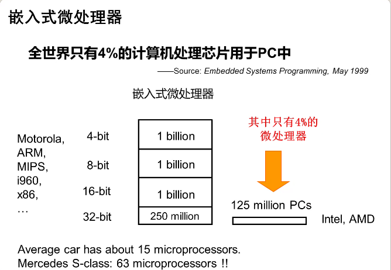
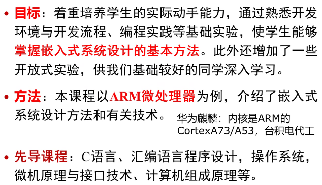
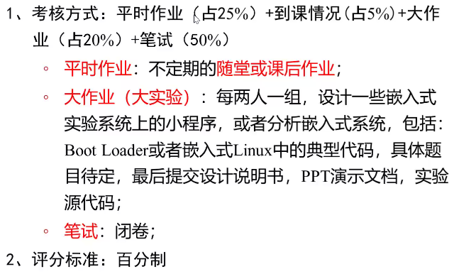

# 引言

## 嵌入式设备举例

- 智能手机
- 智能电视
- Google Glass
- 智能汽车

## 二，为什么要学习嵌入式系统

- 市场需求——嵌入式技术无处不在，手持仪器设备、信息家电、城市建设、工业控制、军事应用······
- 人才需求——软硬件设计人才，应用开发人才，综合性人才······
- 掌握专业只是和提高实践能力的需求
  - 综合性的课程
  - 有利于对其它课程的理解

## 三，课程目标及学习方法

## 六，考核方式和评分标准

