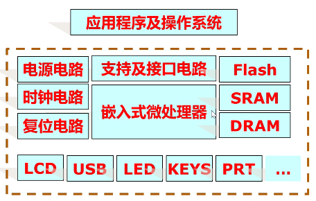
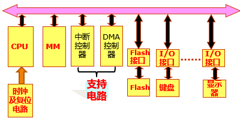
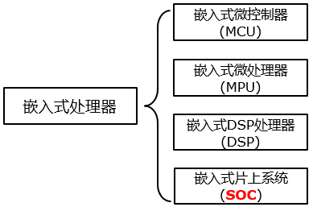
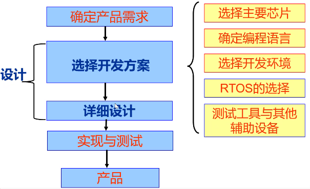

# 第一章 嵌入式系统简介

## 嵌入式系统的定义、特点及架构

### 一，IEEE 定义

1. 不太准确的定义

> "An Embeeded system is the devices used to control, monitor, or assist the operation of equipment, machinery or plants."

此定义是从**应用**上考虑的，嵌入式系统是软件和硬件的综合体，还可以涵盖机电等附属装置

2. 一般定义

以应用为中心，以计算机技术为基础，软、硬件可裁剪，功能/实时性/可靠性/成本/体积/功耗等严格要求的**专用计算机系统**

### 二，嵌入式系统的几个重要特征

#### 1. 系统硬件精简、系统软件内核小

- 由于嵌入式系统一般是应用于小型电子装置的，严格控制硬件成本
- 系统资源相对有限，所以内核较之传统的操作系统要小得多。比如 ENEA 公司的 OSE 分布式系统，内核只有 5KB，而 Windows 的内核则要大得多。

#### 2. 专用性强

- 嵌入式系统的个性化很强，其中的软件系统和硬件的结合非常紧密，一般要针对硬件进行系统的移植。
- 即使在同一品牌、同一系列的产品中也需要根据系统硬件的变化和增减不断进行修改。
- 同时针对不同的任务，往往需要对系统进行较大更改，程序的编译下载要和系统相结合，这种修改和通用软件的“升级”是完全不同的概念。

#### 3. 高实时性 OS

- 这是嵌入式软件的基本要求，所以要缩短中断响应时间，缩短进程上下文切换时间，缩短实时进程调度时间，缩短进程资源分配等待时间，缩短中断处理时间。而且软件要求固态存储，以提高速度。软件代码要求高质量和高可靠性、实时性。
- 操作系统一般是实时操作系统

#### 4. 嵌入式软件开发走向标准化

- 嵌入式系统的应用程序可以没有操作系统直接在芯片上运行。
- 但是，为了合理地调度多任务、利用系统资源、系统函数以及和专家库函数接口，用户必须自行选配 RTOS（Real－Time Operating System）开发平台，这样才能保证程序执行的实时性、可靠性，并减少开发时间，保障软件质量。

#### 5. 嵌入式系统需要开发工具和环境

- 由于其本身不具备自主开发能力，即使设计完成以后，用户通常也是不能对其中的程序功能进行修改，必须有一套开发工具和环境才能进行开发。
- 这些工具和环境一般是基于通用计算机上的软硬件设备以及各种逻辑分析仪、混合信号示波器等。
- 开发时往往有宿主机和目标机的概念，主机用于程序的开发，目标机作为最后的执行机，开发时需要交替结合进行。

### 三，嵌入式系统的架构

一般计算机系统的架构（单总线）

### 四，嵌入式处理器的特点

- **实时性**。具有**较短的中断响应时间**，对**实时多任务的调度**有很强的支持能力，从而使内部的代码和实时内核的执行时间减少到最低限度。
- 嵌入式微处理器必须**低功耗**。尤其是用于便携式的无线及移动的计算和通信设备中靠电池供电的嵌入式系统更是如此，如需要功耗只有 mW 甚至 μW 级。
- 具有功能很强的**存储区保护功能**。这是由于嵌入式系统的软件结构已模块化，而为了避免在软件模块之间出现错误的交叉作用，需要设计强大的存储区保护功能，同时也有利于软件诊断。
- **可扩展的处理器结构**。以能最迅速地开发出满足应用的最高性能的嵌入式微处理器。

### 五，嵌入式微处理器分类

#### 1. 嵌入式微控制器

- 嵌入式微控制器的典型代表是**单片机**，这种８位的电子器件目前在嵌入式设备中仍然有着极其广泛的应用。
- **单片机芯片内部**集成 ROM/EPROM、RAM、总线、总线逻辑、定时/计数器、看门狗、I/O、串行口、脉宽调制输出、A/D、D/A、Flash RAM、EEPROM 等各种必要功能和外设。
- **性能、功能较差，成本低**
- 微控制器的最大特点是**单片化**，体积大大减小，从而使功耗和成本下降、可靠性提高。
- 微控制器是目前嵌入式系统工业的主流。微控制器的片上外设资源一般比较丰富，适合于控制，因此称为微控制器。

#### 2. DSP

- DSP 是专门用于信号处理方面的处理器，其在**系统结构和指令算法方面进行了特殊设计**，在**数字滤波、FFT、谱分析**等各种仪器上 DSP 获得了大规模的应用。
- DSP 的理论算法在 70 年代就已经出现，但是由于专门的 DSP 处理器还未出现，所以这种理论算法只能通过 MPU 等由分立元件实现。 1982 年世界上诞生了首枚 DSP 芯片。在语音合成和编码解码器中得到了广泛应用。 DSP 的运算速度进一步提高，应用领域也从上述范围扩大到了通信和计算机方面。
- 目前最为广泛应用的嵌入式 DSP 处理器是 TI 的 TMS320C2000/C5000 系列，另外如 Intel 的 MCS-296 和 Siemens 的 TriCore 也有各自的应用范围。

#### 3. 嵌入式微处理器（Micro Processor Unit）

- MPU 嵌入式微处理器是由**通用计算机中的 CPU 演变而来**的。
- 与通用计算机处理器不同的是，只保留和嵌入式应用紧密相关的功能硬件，去除其他的冗余功能部分，以降低功耗和成本。
- 嵌入式微处理器具有体积小、重量轻、成本低、可靠性高的优点。目前主要的嵌入式处理器类型有 Am186/88、386EX、SC-400、**Power PC**、68000、**MIPS**、**ARM/StrongARM** 系列等

#### 4. 嵌入式片上系统（System On Chip）

- SoC 就是 System on Chip ，SoC 嵌入式系统微处理器就是一种电路系统。
- 它将许多功能区块集成在一个芯片上，包括**嵌入式微处理器**（ ARM RISC、MIPS RISC、DSP ）、**存储器**及**接口**（通用串行端口（USB）、TCP/IP 通信单元、GPRS 通信接口、GSM 通信接口、IEEE1394、蓝牙模块接口等）、总线等。

### 六 RTOS 是 32 位嵌入式 CPU 的软件基础

- RTOS 内核 提供 CPU 的管理
  - 硬件初时化，MMU，定时器，中断
- RTOS 内核提供任务调度、内存管理
- RTOS 可能提供设备管理，文件和网络的支持
- RTOS 提供 C/C++，JAVA，图形模块等编程接口

## 嵌入式系统与单片机、PC 的区别

### 一，嵌入式系统 $neq$ 单片机系统

- 单片机系统（微控制器）可以看成嵌入式系统的子类，区别主要在性能上：
  - 目前嵌入式系统的主流是以 32 位嵌入式微处理器（SoC）为核心的硬件设计和基于实时操作系统（RTOS）的软件设计
  - 单片机系统多为 4 位、8 位、16 位机，不适合运行操作系统，难以进行复杂的运算及处理功能

### 二， 嵌入式系统 $neq$ PC 机

- 嵌入式系统一般是专用系统，而 PC 是通用计算平台
- 嵌入式系统的资源比 PC 少得多
- 嵌入式系统软件故障带来的后果比 PC 机大得多
- 嵌入式系统一般采用实时操作系统
- 嵌入式系统大都有成本、功耗的要求
- 嵌入式系统得到多种微处理器体系的支持
- 嵌入式系统需要专用的开发工具

## 嵌入式系统应用领域及发展趋势

### 一，嵌入式系统的应用领域

- 电子通讯
- 信息家电
- 网络安全、设备
- 工业自动化
- 精密仪器

### 二，嵌入式系统的发展趋势

## 嵌入式系统的设计流程

### 一，嵌入式系统的设计流程

- 嵌入式系统设计的三阶段：
  - 分析（需求分析阶段）：确定需要解决的问题和要完成的目标；
  - 设计：如何在给定的约束条件下完成用户的要求；
  - 实现：在所选择的硬件和软件的基础上进行整个软、硬件系统的协调实现。
- 设计阶段最主要的工作：
  - 软件平台和硬件平台的选择。

嵌入式系统的开发流程

- 软、硬件平台选择的主要工作：
  - 处理器；
  - 硬件部件；
  - 操作系统；
  - 编程语言；
  - 软件开发工具；
  - 硬件调试工具；
  - 软件组件等等；
- 处理器是最重要的，操作系统和编程语言非常关键
  - 处理器限制操作系统的选择，进而限制开发工具的选择。
