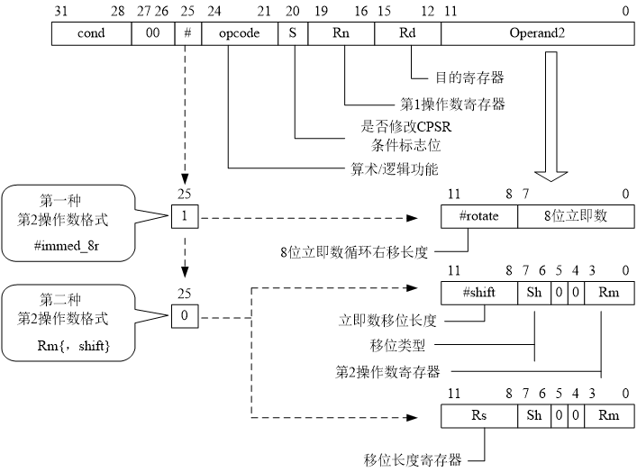

# 第三章 ARM 嵌入式处理器的指令系统

## 指令集特点和概要

### 1. 指令长度——定长

- 指令集可以是以下任一种
  - 32 bits 长 (ARM 状态)——重点
  - 16 bits 长 (Thumb 状态)
- ARM9TDMI 支持 3 种数据类型
  - 字节 (8-bit)
  - 半字 (16-bit)
  - 字 (32-bit)
- 字必须被排成 4 个字节边界对齐,半字必须被排列成 2 个字节边界对齐

### 2. ARM 指令集的特点

- 向后兼容：新版本增加指令，并保持指令向后兼容；
- Load-store 结构——RISC 的特点
  - load/store –从存储器中读某个值,操作完后再将其放回存储器中
  - 只对存放在寄存器的数据进行处理；
  - 对于存储器中的数据，只能使用 load/store 指令进行存取

> RISC 的特点：精简指令集、Load-store 结构、指令格式编码规整、通用寄存器多、流水线完善、优化编译

### 3. ARM 指令分类

- 数据处理指令 – 使用和改变寄存器的值：传送、运算
- 存储器访问指令
  - 把存储器的值拷贝到寄存器中 (load)
  - 把寄存器中的值拷贝到存储器中(store)
- 控制流指令(跳转指令)
  - 分支
  - 分支和链接, 保存返回的地址,以恢复最先的次序
- 杂项指令：软件中断指令，程序状态寄存器指令
- 协处理器指令
- 饱和算术指令

#### 数据处理指令

<div align=center></div>

#### 跳转指令

<div align=center></div>

#### 存储访问指令

<div align=center></div>

#### 协处理器指令

<div align=center></div>

#### 杂项指令

<div align=center></div>

#### 饱和算术指令

> 饱和运算：当计算结果大于可表示的最大值或者小于可表示的最小值时，计算结果取最大值或最小值。

<div align=center></div>

## ARM 指令集的语法规则

### 1. ARM 指令集的语法

一条典型的 ARM(汇编)指令语法如下所示：

```
<opcode> {< cond> }{S} <Rd>, {<Rn>} {,<Operand2>}
```

- `<opcode>` 指令助记符，决定了指令的操作。例如：`ADD`
- `{<cond>}` 指令执行的条件，可选项。与 `opcode` 合并
- `{S}` 决定指令操作是否影响 CPSR 的值，可选项。与 `opcode` 合并，比如 `MOVCCS`
- `<Rd>` 表示目标寄存器，必有项。
- `<Rn>` 表示包含第 1 个操作数的寄存器，可选项，当仅需要一个源操作数时可省略。如：`MOV R4,#0XA0000002`
- `{,<Operand2>}` 表示第 2 个操作数，可选项。第 2 操作数有两种格式：`#immed_8r`，`Rm{, Shift}`

### 2. 灵活的第二操作数（12 位）

<div align=center></div>

#### 2.1 立即数型——`#immed_8r`

- 在汇编指令中的格式： `#<32位立即数>`
- 问题：32 位机器指令中操作码、条件码、目的数、第一操作数等占 20 位，第二操作数只有 **12 位**，须提高表数范围
- 要求：必须由一个 8 位的立即数**循环右移偶数位**得到，否则在机器指令中无法编码
- 方法：机器指令最低 8 位（bit[7:0]）表示 8 位常数，bit[11:8]表示循环右移次数，立即数就是由 8 位常数循环右移 2\*bit[11:8]次得到。

举例：将 `0x7F02` 送给 `R3`

```assembly
    MOV R3, #0x7F00 ; 机器码 E3 A0 3C 7F
    ORR R3, R3, #2  ; 2 也是 #immed_8r
```

解释： 8 位常数 `7F` 右移 2 \* C 位（24 位）得到 `7F00`，然后再与常数 2 作与运算得到 `0x7F02`

另一种办法（使用伪指令）

```assembly
    LDR R1, =0x7F02
    MOV R3, R1
```

#### 2.2 寄存器移位型——`{Rm{, <shift>}}`

1. 无第 2 操作数

```assembly
    MOV PC, LR ; PC←(R14)
```

2. 只有 Rm

```assembly
    SUB R1, R1, R2 ; R1←(R1－R2)
```

3. `Rm, <shift>`

```assembly
    ADD R5, R3, R1, LSL #2   ;R5←R3+R1*4
```

`<shift>` 含义

- `LSL #n`：逻辑左移 n 位，低端空位补 0。
- `LSR #n`：逻辑右移 n 位 ，高端空位补 0。
- `ASR #n`：算术右移 n 位，保持符号位不变
- `ROR #n`：循环右移 n 位，低端移出位填入高端。
- `RRX`：带进位的循环右移 1 位，第 31 位用原进位
  C 填入，如果指定后缀“S”，则将 Rm 原
  值的位[0]移到进位标志。

n 的要求：0≤n≤31，若 n=32，汇编错误；若 n=0，则不移位

## ARM 的寻址方式

### ARM 处理器寻址方式

## ARM 指令集详解

## ARM 伪指令
