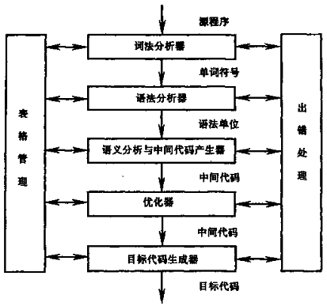
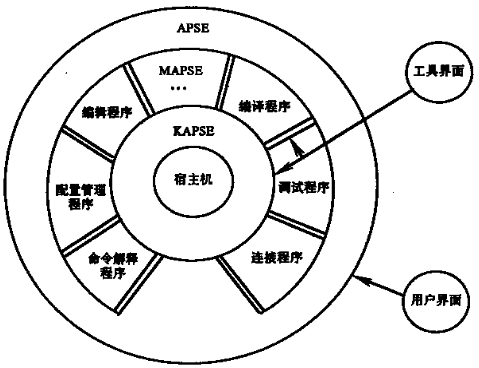

# 第一章 引论

## 1.1 什么叫编译程序

**翻译程序**：能够把某一种语言程序（称为**源语言**程序）转换成另一种语言程序（称为**目标语言**程序）的程序

**解释程序**：以该语言写的源程序作为输入，但不产生目标程序，而是边解释边执行源程序本身

**诊断编译程序**（Diagnostic Compiler）：专门用于帮助程序开发和调试的编译程序

**优化编译程序**（Optimizing Compiler）：着重于提高目标代码效率的编译程序

**交叉编译程序**（Cross Compiler）：可以产生不同于其宿主机的机器代码的编译程序

**可变目标编译程序**（Retargetable Compiler）：不需要重写编译程序中与机器无关的部分就能改变目标机的编译程序

## 1.2 编译过程概述

- 词法分析
- 语法分析
- 语义分析
- 中间代码产生
- 优化
- 目标代码生成

## 1.3 编译程序的结构

### 1.3.1 编译程序总框

### 1.3.2 表格与表格管理

**符号表**：用来登记源程序中出现的每个名字以及名字的各种属性

### 1.3.3 出错处理

- 语法错误：源程序中不符合语法（或词法）规则的错误，可以在词法分析或语法分析时检测出来
- 语义错误：源程序中不符合语义规则的戳五，一般在语义分析时检测出来，有的语义错误要在运行时才能检测出来

### 1.3.4 遍

遍：对源程序或源程序的中间结果从头到尾扫描一次，并作有关的加工处理，生成新的中间结果或目标程序

### 1.3.5 编译前端与后端

- 编译前端：与源语言有关但与目标机无关的部分。如词法分析、语法分析、语义分析与中间代码生成，还有部分代码优化过程
- 编译后端：编译程序中与目标机有关的部分。如与目标及有关的代码优化和目标代码生成等

## 1.4 编译程序与程序设计环境

Ada 程序设计环境

## 1.5 编译程序的生成
