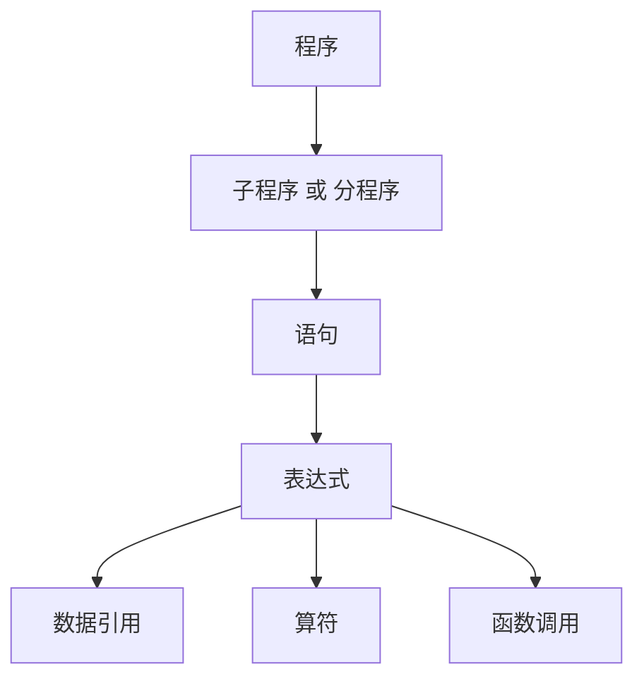

# 第二章 高级语言及其语法描述

从语言范型来分，高级语言可分为：

- 强制型语言
- 作用式语言
- 基于规则的语言
- 面向对象语言

## 2.1 程序语言的定义

### 2.1.1 语法

语言的单位符号是由词法规则所确定的。词法规则规定了字母表中哪样的字符串是一个但此符号

**词法规则**是指单词符号的形成规则

语言的**语法规则**规定了如何从单词符号形成更大的结构（即语法单位）

一般程序语言的语法单位有：表达式、语句、分程序、函数、过程和程序等等

语言的词法规则和语法规则定义了程序的形式结构，是判断输入字符串是否构成一个形式上正确程序的依据

### 2.1.2 语义

所谓一个语言的语义是指这样的一组规则，使用它可以定义一个程序的意义。这些规则称为语义规则

一个程序语言的基本功能是描述数据和对数据的运算。在现今的程序语言中，一个程序大体上可视为下面所示的层次结构：



## 2.2 高级语言的一般特性

### 2.2.1 高级语言的分类

1. **强制式语言**（Imperative Language）：也成为过程式语言。其特点是命令驱动，面向语句。一个强制式语言程序由一系列的语句组成，每个语句的执行引起若干存储单元中的值的改变
2. **应用式语言**（Applicative Languange）：更注重程序所表示的功能，而不是一个语句接一个语句地执行
3. **基于规则的语言**（Rule-based Languange）：检查一定的条件，当它满足值，则执行适当的操作
4. **面向对象语言**（Object-Oriented Languange）：主要的特征是支持封装性、继承性和多态性等

### 2.2.2 程序结构

- `FORTRAN`

```fortran
PROGRAM MAIN
...
END
SUBROUTINE SUB1
...
END
SUBROUTINE SUBn
...
END
```

- `Pascal`

```pascal
program main
...
  procedure P1:
  ...
    procedure P11:
    ...
    begin
    ...
    end;
  begin
  ...
  end;
  procedure P2:
  ...
  begin
  ...
  end;
begin
...
end.
```

- `Ada`

```ada
package STACKS is
  type ELEM is private;
  type STACK is limited private;
  procedure push (S: in out STACK; E: in ELEM);
  procedure pop (S: in out STACK; E: out ELEM);
  ...
end STACK;
package body STACK is
  procedure push(S: in out STACK; E: in ELEM);
  begin
  ...
  end push;
  procedure pop (S: in out STACK; E: out ELEM);
  begin
  ...
  end pop;
end;
```

- `Java`

```java
clas Car {
  int color_number;
  int door_number;
  int speed;
  ...
  push_break() {
    ...
  }
  Add_oil() {
    ...
  }
}

class Trash_Car extends car {
  double amount;
  fill_trash(){
    ...
  }
}
```

### 2.2.3 数据类型与操作

一个数据类型通常包括以下三种要素：

1. 用于区别这种类型的数据对象的属性
2. 这种类型的数据对象可以具有的值
3. 可以作用于这种类型的数据对象的操作

#### 一，初等数据类型

常见的初等数据类型有：

1. 数值数据
2. 逻辑数据
3. 字符数据
4. 指针类型

一个名字的属性包括**类型**和**作用域**

#### 二，数据结构

1. 数组
2. 记录
3. 字符串、表格、栈和队列

#### 三，抽象数据类型

一个抽象数据类型包括：

1. 数据对象的一个集合
2. 作用于这些数据对象的抽象运算的集合
3. 这种类型对象的封装

### 2.2.4 语句与控制结构

#### 一，表达式

一个表达式由运算量和算符组成

对于多数程序语言来说，表达式的形成规则可概括为：

1. 变量（包括下标变量）、常数是表达式
2. 若 $E_1,E_2$ 为表达式，$\theta$ 是一个二元算符，则 $E_1\theta E_2$ 是表达式（一般采用中缀形式）
3. 若 $E$ 是表达式，$\theta$ 为一元算符，则 $\theta E$（或 $E\theta$）是表达式
4. 若 $E$ 是表达式，则 $(E)$ 是表达式

#### 二，语句

1. 赋值句
2. 控制语句
3. 说明句
4. 简单句和复合句

## 2.3 程序语言的语法描述

### 2.3.1 上下文无关文法

### 2.3.2 语法分析树与二义性

### 2.3.3 形式语言鸟瞰
