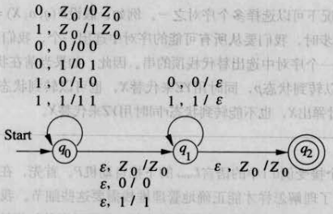

# 第 6 章 下推自动机

## 6.1 下推自动机的定义

### 6.1.1 定义

下推自动机（Pushdown Automaton，PDA）的形式化定义包括七部分。PDA 的描述如下：

$$
P=(Q,\Sigma, \Gamma,\delta,q_0,Z_0,F)
$$

这些组成部分的意义如下：

1. $Q$：状态集合
2. $\Sigma$：输入符号的有穷集合
3. $\Gamma$：堆栈字母表
4. $\delta$：转移函数
5. $q_0$：初始状态
6. $Z_0$：初始符号
7. $F$：接收状态集合

### 6.1.2 图形表示

上图中：

1. 节点表示 PDA 的一个状态
2. `Start` 为初始状态，双圈表示接受状态
3. 箭头表示 PDA 转移，如 `1, 0|10` 表示当栈顶为 0 时，如果输入 1，栈顶变为 10

### 6.1.3 瞬时描述

我们用 $(q,w,\gamma)$ 表示 PDA 的瞬时状态，其中

1. $q$ 是状态
2. $w$ 是剩余的输入串
3. $\gamma$ 是堆栈的内容

令 $P=(Q,\Sigma,\Gamma,\delta,q_0,Z_0,F)$ 是一个 PDA。定义 $\vdash$ 为：假设 $\delta(q,a,X)$ 包含 $(p,\alpha)$，那么对于所有 $\Sigma^*$ 中的串 $w$ 和 $\Gamma^*$ 中的串 $\beta$ 都有：

$$
(q,aw,X\beta)\vdash(p,w,\alpha\beta)
$$

这一步移动反映了下面的想法：通过从输入中消耗 a （或者 $\epsilon$）并且用 $\alpha$ 来替换栈顶的 $X$，可以从状态 $q$ 转换到状态 $p$

## 6.2 PDA 的语言

### 6.2.1 以终结状态方式接受

设 $P=(Q,\Sigma,\Gamma,\delta,q_0,Z_0,F)$ 是一个 PDA，那么 P 以终结状态方式接受的语言 $L(P)$ 是：

$$
\{w|(q_0,w,Z_0)\vdash^*_P(q,\epsilon,\alpha),q\in F\}
$$

